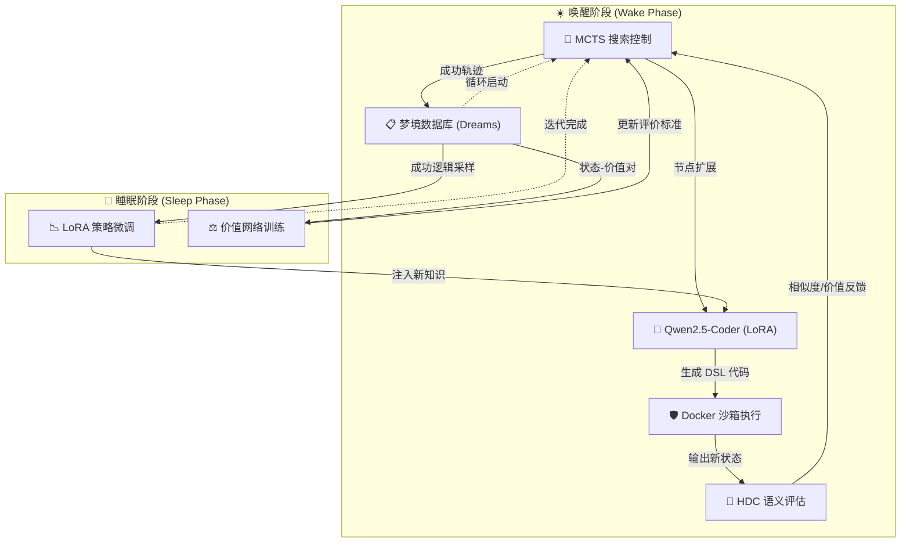

# 🌌 Project Laplace: 神经符号进化智能体 ✨

[](https://www.python.org/downloads/)
[](https://pytorch.org/get-started/locally/)
[](https://github.com/unslothai/unsloth)
[](https://opensource.org/licenses/MIT)

> "通过神经符号进化，解码 ARC 宇宙的底层逻辑。" —— **Laplace Project** 🧩

**Project Laplace** 是一个基于 **神经符号 AI (Neuro-Symbolic AI)** 的自主智能体系统，专注于通过程序合成 (Program Synthesis) 攻克 **ARC (Abstraction and Reasoning Corpus)** 任务。它巧妙地结合了 **大语言模型 (LLM)** 的创造力、**蒙特卡洛树搜索 (MCTS)** 的决策力以及 **高维计算 (HDC)** 的感知力，实现了独特的 **"Wake-Sleep" (唤醒-睡眠)** 自进化机制。

---

## 🏗️ 系统架构：自进化循环

Laplace 项目的核心在于其能够像生物一样，在“唤醒”阶段探索世界，在“睡眠”阶段反思学习。



---

## 🌟 核心特性 (Key Features)

### 1. 🧠 神经符号混合驱动
不同于纯端到端的黑盒模型，Laplace 使用经过 LoRA 微调的 **Qwen2.5-Coder** 生成 Python 代码。代码基于预定义的 **DSL (领域特定语言)**，确保了求解过程的**强逻辑性**与**可解释性**。

### 2. 🌳 MCTS + HDC 搜索空间缩减
*   **MCTS 引导**：在庞大的代码生成空间中，利用蒙特卡洛树搜索进行高效剪枝。
*   **HDC 编码**：引入 **高维计算 (Hyperdimensional Computing)**，将复杂的网格状态编码为万维超向量，利用余弦相似度极速评估状态收益。

### 3. ☀️🌙 唤醒-睡眠 (Wake-Sleep) 机制
*   **唤醒**：智能体尝试解决 ARC 任务，将成功的路径记录为“梦境”。
*   **睡眠**：在后台通过这些梦境数据自动进行 LoRA 训练和价值网络更新，实现智能体的自我进化，无需人工干预。

### 4. 🛡️ 工业级安全沙箱
内置 **Docker Sandbox** 与 AST 静态检查，确保 LLM 生成的任何 Python 代码都在完全隔离的环境中执行，防止任何潜在的系统风险。

---

## 📂 模块深度解析 (Module Deep Dive)

| 模块 | 职责与设计哲学 | 核心技术 |
| :--- | :--- | :--- |
| `src/dsl.py` | **公理系统**：定义了 ARC 宇宙的底层原语，如 `flood_fill`, `get_objects` 等。 | 语义抽象层 |
| `src/mcts.py` | **决策大脑**：负责在搜索树中平衡探索与利用 (UCT 算法)。 | 路径搜索 |
| `src/hdc.py` | **感知系统**：将具体像素映射至高维语义空间，提供非参数化的相似度度量。 | 超向量编码 |
| `src/agent_lora.py` | **生成引擎**：封装了经过 Unsloth 加速的 LLM，负责生成符合约束的代码块。 | 变分推理 |
| `src/executor.py` | **安全屏障**：执行生成的代码，并捕获反馈（错误、输出网格）。 | 沙箱技术 |

---

## 🚀 快速上手 (Quick Start)

### 1. 环境准备
推荐使用 Python 3.10+ 环境。

```bash
# 克隆项目
git clone https://github.com/lkcfqy/project_laplace.git
cd project_laplace

# 安装核心依赖 (推荐使用虚拟环境)
pip install torch torchvision torchaudio
pip install unsloth "unsloth[colab-new]" 
pip install docker transformers datasets trl peft bitsandbytes
```

### 2. 启动自进化循环 (Wake-Sleep)
只需一条命令，智能体将开始自动探索并进化：

```bash
python src/bootstrap_loop.py
```

### 3. 单独测试求解器
如果您想手动指定一个任务进行 MCTS 求解：

```bash
python src/solve.py --mode mcts --task_file data/arc/training/25d8a9c8.json
```

---

## ⚠️ 开发者建议
*   **显存要求**：默认配置优化为 24GB VRAM（如 RTX 3090/4090）。若显存不足，请在 `src/train.py` 中减小 `batch_size`。
*   **Docker 权限**：若要使用沙箱，请确保当前用户已加入 `docker` 组。

---

## 🤝 贡献与参与
我们欢迎任何关于 DSL 扩展、MCTS 算法优化或 HDC 编码改进的建议。请随时提交 Issue 或 Pull Request！

## 📜 许可证
本项目采用 **MIT License**。

---
> Generated with ❤️ by **Antigravity** 🛸
